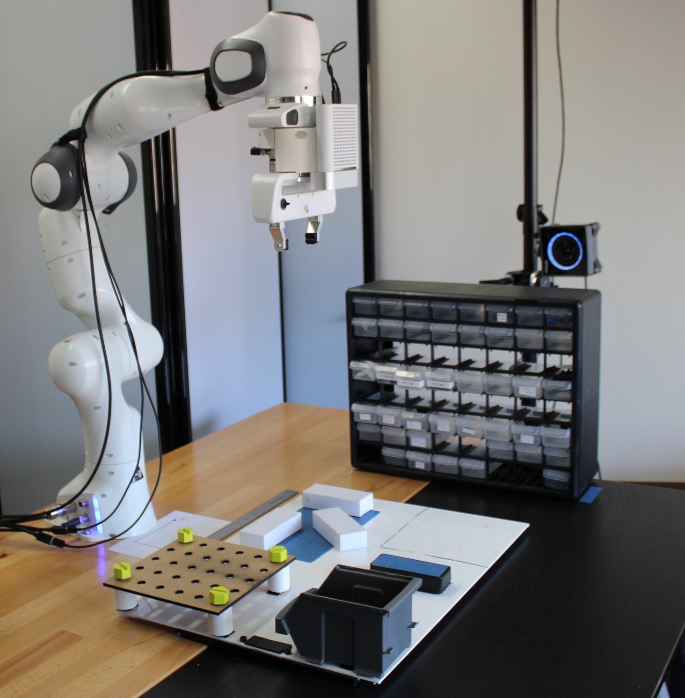

Trigger-Action Programming for Human-Robot Collaboration
============================================
Robot Controller
----------------

*This work is part of a larger project, it is designed to be used with the
[Authoring Interface](https://github.com/emmanuel-senft/authoring-gui/tree/authoring-study).*



## Notes

This guide is designed for system using a Panda robot controlled through a graphical user interface, possibly remotely. The physical system requires a panda outfitted with an azure kinect on the end-effector using the printed mount provided in the [meshes folder](https://github.com/emmanuel-senft/authoring-ros/tree/study/meshes) and ATI Axia80-M20 6-axis force torque sensor. The physical system requires a computer running Ubuntu 18.04 for the [Kinect Ros driver](https://github.com/microsoft/Azure_Kinect_ROS_Driver), a computer running Ubuntu 20.04 for the [Object Localisation](https://github.com/kpwelsh/Mesh-Pose-Detector-ROS). The present code can be run on either platform. The panda low-level controller and interface with the ATI can be found [here](https://github.com/Wisc-HCI/panda-primitives-control). More information to recreate the workspace can be requested by contacting <esenft@wisc.edu>.

However, we also provide a simulated system that can be run on a single Ubuntu computer without the robot.*


## Setup
This setup requrires you to be on an Ubuntu machine and install and start [Docker](https://docs.docker.com/engine/install/ubuntu/).

First set up display forwarding:
```bash
xhost +local:
```
Now  build the container image and start the container. Make sure you are in this root directory (NIST_Benchmark). These commands mount on the current directory as the containers file system so any changes you make to the files on your host machine will be mirrored in the container. These commands also allow the containers display to be forwarded to your host machine so that you can see it.
```bash
sudo docker build -t panda-prim .

# Start the container with real-time kernel privileges, mount onto the current directory, and allow display forwarding. Container is removed once it exits.
sudo docker run --rm -it --privileged --cap-add=SYS_NICE --env DISPLAY=$DISPLAY -v /tmp/.X11-unix:/tmp/.X11-unix -v $(pwd):/workspace --net=host panda-prim
```

Now build the repo
```bash
catkin build authoring
source devel/setup.bash
```

## Usage
The correct ROS_IP environment variable needs to be set before use.

First, start `roscore` in a dedicated terminal.

### Starting the robot controller for simulation use only
- `roslaunch authoring all.launch only_virtual:=true`

### Starting the GUI

This system is designed to be interfaced with the [Task-Level Authoring](https://github.com/emmanuel-senft/authoring-gui/) which can be run using QtCreator or served on a website.

To start a condition, run the related code through QtCreator. Of note, the default setting for this release is simulation, but when using the real system (`roslaunch authoring all.launch`), the line `property bool simu: true` in each main.qml file needs to be set to `false`.